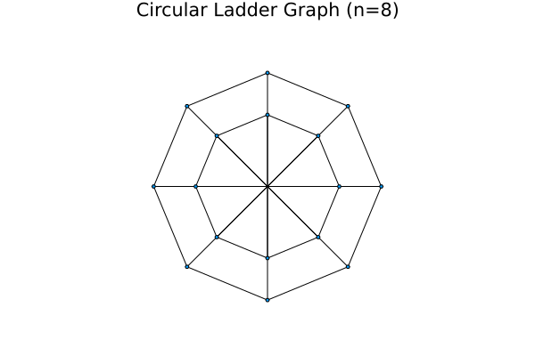
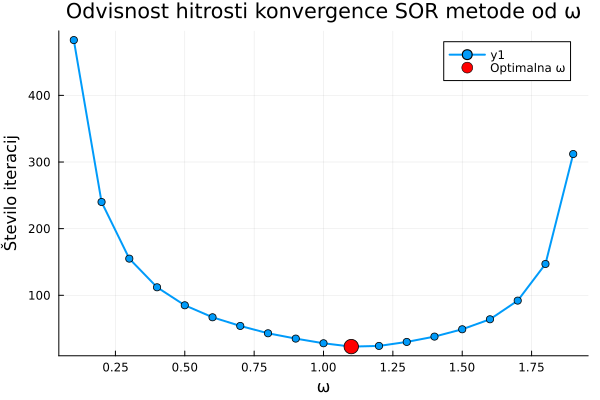

# Dokumentacija za Domačo Nalogo 1

## Funkcionalnosti paketa

```@docs 
RedkaMatrika
sor

Base.getindex
Base.size
Base.setindex!
Base.:*
```

## Uporaba metode
V tem poglavju si bomo pogedali primer uporabe metode `sor` na problemu vložitvi grafa v ravnino. Nato bomo na primeru poiskali optimalni \(\omega\).

### Vložitev grafa v ravnino

Za demonstracijo uporabe SOR metode smo implementirali algoritem za vložitev grafa v ravnino z uporabo fizikalne metode. Ta metoda modelira graf kot sistem vzmeti, kjer so vozlišča predstavljena kot masne točke, povezave pa kot vzmeti z naravno dolžino nič.

#### Matematični model

Fizikalna metoda temelji na minimizaciji energije sistema vzmeti. Za graf $G = (V, E)$ z vozlišči $V$ in povezavami $E$ definiramo energijsko funkcijo:

$$E = \frac{1}{2} \sum_{(i,j) \in E} ||p_i - p_j||^2$$


kjer je $p_i$ pozicija vozlišča $i$ v ravnini. Minimum te funkcije dosežemo, ko je za vsako prosto vozlišče $i$ izpolnjen pogoj:

$$\sum_{j \in N(i)} (p_i - p_j) = 0$$

kjer je $N(i)$ množica sosedov vozlišča $i$. To vodi do sistema linearnih enačb oblike $$Ax = b$$, kjer matrika $A$ vsebuje informacije o strukturi grafa.

#### Primer: krožna lestev

Kot testni primer smo uporabili krožno lestev z $n = 8$ vozlišči na vsakem od dveh ciklov. Graf ima skupaj 16 vozlišč, pri čemer so vozlišča prvega cikla (1-8) fiksirana na enotski krožnici, vozlišča drugega cikla (9-16) pa so prosta in jih določimo z optimizacijo.



Rezultat prikazuje simetrično vložitev, kjer so prosta vozlišča razporejena v notranjem krogu, povezana pa so z ustreznimi vozlišči na zunanjem krogu.

### Optimalni omega

Parameter $\omega$ v SOR metodi določa hitrost konvergence iterativnega postopka. Za optimalno delovanje metode je ključno določiti pravo vrednost tega parametra.

#### Teoretično ozadje

SOR metoda je posplošitev Gauss-Seidlove iteracije z relaksacijskim parametrom $\omega$:

$$x_i^{(k+1)} = (1-\omega)x_i^{(k)} + \frac{\omega}{a_{ii}}\left(b_i - \sum_{j<i} a_{ij}x_j^{(k+1)} - \sum_{j>i} a_{ij}x_j^{(k)}\right)$$

Za simetrične pozitivno definitne matrike obstaja optimalna vrednost $\omega_{opt}$, ki minimizira spektralni radij iteracijske matrike.

#### Eksperimentalna analiza

Za sistem linearnih enačb iz problema vložitve krožne lestvi smo testirali različne vrednosti parametra $\omega$ v intervalu $[0.1, 1.9]$ in izmerili število iteracij potrebnih za konvergenco.



Rezultati kažejo tipično U-obliko krivulje, kjer:
- Pri nizkih vrednostih $\omega < 1$ je konvergenca počasna (podrelaksacija)
- Optimalna vrednost $\omega_{opt} = 1.1$ zagotavlja najhitrejšo konvergenco
- Pri visokih vrednostih $\omega > 1.5$ se hitrost konvergence ponovno zmanjša (nadrelaksacija)

#### Rezultati

Za obravnavani sistem smo dobili:
- **Optimalna vrednost**: $\omega_{opt} = 1.1$
- **Minimalno število iteracij**: 23 iteracij

Ta rezultat je skladen s teoretičnimi pričakovanji za pozitivno definitne sisteme, kjer optimalna vrednost $\omega$ običajno leži med 1 in 2. Vrednost $\omega = 1.1$ kaže na to, da je za ta specifičen problem potrebna le rahla nadrelaksacija za dosego optimalnih rezultatov.