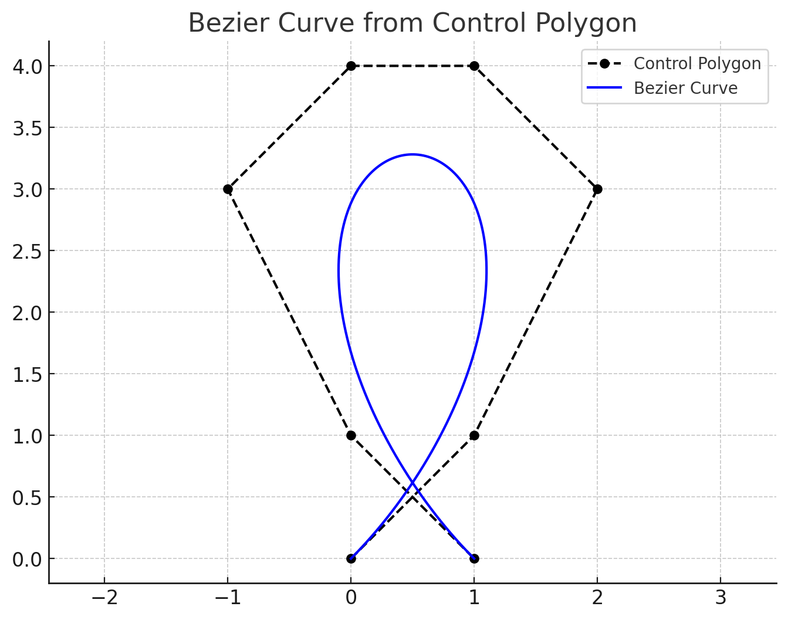

# Dokumentacija za Domačo Nalogo 2

## Funkcionalnosti paketa

```@docs
de_casteljau
calculate_bezier_loop_area
calculate_bezier_loop_area_auto_detect
find_bezier_self_intersection
```

---

## 1   Algoritem de Casteljau

[Algoritem de Casteljau](https://en.wikipedia.org/wiki/De_Casteljau%27s_algorithm) je stabilen in numerično robusten postopek za evalvacijo (in razbitje) Bézierjeve krivulje stopnje $n$.

Bézierova krivulja je podana parametriično s formulo:

$$\mathbf{B}(t)=\sum_{i=0}^{n}{n \choose i}(1-t)^{n-i}t^{i}\mathbf{P}_{i},\qquad t\in[0,1],$$

kjer so $\mathbf{P}_{i}$ kontrolne točke.

### 1.1   Rekurzivna interpolacija
Algoritem temelji na ponavljajoči se linearni interpolaciji med zaporednimi točkami:

$$\mathbf{P}^{(k)}_{i}(t)=(1-t)\,\mathbf{P}^{(k-1)}_{i}(t)\;+\;t\,\mathbf{P}^{(k-1)}_{i+1}(t),\quad k=1,\dots ,n,$$

pri čemer $\mathbf{P}^{(0)}_{i}=\mathbf{P}_{i}$.  
Po $n$ korakih ostane ena sama točka $\mathbf{P}^{(n)}_{0}(t)=\mathbf{B}(t)$.

### 1.2   Implementacija
V funkciji `de_casteljau(points, t)` se:

1. Kopira vhodni vektor koeficientov (1D projekcija),
2. izvede zgornja interpolacija v dveh gnezdenih zankah,
3. Vrne položaj Bézierove krivulje $B(t)$ v $t$.

Zahvaljujoč zgolj seštevanju in množenju z realnimi števili je algoritem brez problemov z nestabilnostjo, ki pestijo direktno evalvacijo Bernstein-ove vsote za večje $n$.

---

## 2   Ploščina zaprtih Bézierjevih zank

### 2.1 Greenova formula
Naj bo $\mathbf{r}(t)=(x(t),y(t))$ gladka, zaprta krivulja z $t\in[0,1]$.  
[Greenova formula](https://en.wikipedia.org/wiki/Green%27s_theorem) poda ploščino

$$A=\frac12\oint_{\mathbf{r}}\bigl(x\,dy-y\,dx\bigr)=\frac12\int_{0}^{1}\!\bigl[x(t)\,y'(t)-x'(t)\,y(t)\bigr]\,dt.$$

Za Bézierjevo krivuljo dobimo polinom stopnje $n-1$. Integral torej lahko izračunamo eksaktno z [Gauss–Legendrejevo kvadraturo](https://dlmf.nist.gov/3.5). V nalogi uporabimo 20-točkovno kvadraturo, ki [omogoča zadostno natančnost](https://en.wikipedia.org/wiki/Gauss%E2%80%93Legendre_quadrature).

### 2.2   Koraki funkcije `calculate_bezier_loop_area`

1. **Ločimo koordinate kontrolnih točk v vektorja `px`, `py`**:  
   Bézierova krivulja je parametrična krivulja, kjer vsaka točka $(x(t), y(t))$ izhaja iz ločenih Bernstein-ovih polinomov za $x$ in $y$ koordinate. Zato moramo kontrolne točke ločiti v dva vektorja za neodvisno evalvacijo.

2. **Izračunamo kontrolne točke odvodov $x'(t)$ in $y'(t)$**:  
   Odvod Bézierove krivulje stopnje $n$ je Bézierova krivulja stopnje $n-1$ s kontrolnimi točkami:
   $$\mathbf{P}'_{i}=n\bigl(\mathbf{P}_{i+1}-\mathbf{P}_{i}\bigr)$$
   To izhaja iz odvoda Bernstein-ovih polinomov ([vir](https://pages.mtu.edu/~shene/COURSES/cs3621/NOTES/spline/Bezier/bezier-der.html)).

3. **Preslikava vozlišč Gauss-Legendre kvadrature**:  
   Standardna Gauss-Legendre kvadratura je definirana na intervalu $[-1, 1]$. Za integracijo na intervalu $[a, b]$ uporabimo linearno preslikavo:
   $$t = \frac{b-a}{2}\xi + \frac{a+b}{2}$$
   kjer je $\xi \in [-1, 1]$ standardno vozlišče. V našem primeru je $a = t_{start}$ in $b = t_{end}$.

4. **Evalvacija integranda**:  
   Za vsako preslikano vozlišče $t_k$ ovrednotimo integrand:
   $$f(t_k) = x(t_k)\,y'(t_k) - x'(t_k)\,y(t_k)$$
   z uporabo `de_casteljau` algoritma.

5. **Končni izračun**:  
   Seštejemo $w_k f(t_k)$ (kjer so $w_k$ uteži kvadrature) in pomnožimo s skalacijskim faktorjem $\frac{b-a}{2}$ ter z $\frac{1}{2}$ iz Greenove formule.

### 2.3   Avtomatska detekcija zanke in izračun ploščine

Funkcija `calculate_bezier_loop_area_auto_detect` avtomatsko najde točko samopresečišča Bézierove krivulje in izračuna ploščino nastale zanke. Postopek poteka v dveh fazah:

#### 2.3.1   Groba iskanje samopresečišča
1. **Vzorčenje krivulje**: Krivuljo vzorčimo z $1000$ enakomerno razporejenimi točkami na intervalu $[0, 1]$.
2. **Iskanje najbližjih točk**: Poiščemo par točk $(t_1, t_2)$ z minimalno razdaljo, kjer je $|t_1 - t_2| > 0.01$ (zagotavlja, da ne primerjamo sosednjih točk).
3. **Preverjanje pravilnosti**: Če je minimalna razdalja večja od $10^{-3}$, krivulja nima samopresečišča.

#### 2.3.2   Iterativno izboljšanje
1. **Omejitev iskalnega območja**: Okoli najdenih $t_1$ in $t_2$ vzpostavimo majhno iskalno okno.
2. **Gnezdeno vzorčenje**: V oknu vzorčimo z $10$ točkami in ponovno poiščemo najbližji par.
3. **Zmanjšanje okna**: Iskalno okno postopoma zmanjšujemo za faktor $5$ v vsaki iteraciji.
4. **Konvergenca**: Postopek se ustavi, ko je razdalja med točkama manjša od $10^{-12}$.

#### 2.3.3   Izračun ploščine zanke
Ko imamo točki samopresečišča $(t_{start}, t_{end})$, izračunamo ploščino zanke z integracijo Greenove formule na intervalu $[t_{start}, t_{end}]$:
$$A = \frac{1}{2}\int_{t_{start}}^{t_{end}} \bigl[x(t)\,y'(t) - x'(t)\,y(t)\bigr]\,dt$$

## 3   Konkreten primer uporabe

### 3.1   Opis primera

Razmislimo o Bézierjevi krivulji stopnje 7, definirani z naslednjimi kontrolnimi točkami:

```julia
CONTROL_POLYGON = [
  ( 0.0, 0.0),  # P₀ - začetna točka
  ( 1.0, 1.0),  # P₁
  ( 2.0, 3.0),  # P₂
  ( 1.0, 4.0),  # P₃
  ( 0.0, 4.0),  # P₄
  (-1.0, 3.0),  # P₅
  ( 0.0, 1.0),  # P₆
  ( 1.0, 0.0)   # P₇ - končna točka
]
```

Ta kontrolni poligon definira krivuljo, ki se sama sebe preseka in tvori zanko. Na sliki spodaj je prikazana Bézierova krivulja (modra črta) z označenimi kontrolnimi točkami (rdeče točke) in kontrolnim poligonom (črtkana črta).



### 3.2   Avtomatska detekcija samopresečišča

Ko pokličemo funkcijo `calculate_bezier_loop_area_auto_detect`, algoritem:

1. **Najde samopresečišče**: Algoritem je uspešno zaznal točko samopresečišča pri koordinatah $(0.5, 0.616)$
2. **Določi parametre**: Najdeni parametri so $t_1 = 0.075$ in $t_2 = 0.925$
3. **Izračuna ploščino**: Ploščina zanke je $A = 2.254$ kvadratnih enot

```julia
area = calculate_bezier_loop_area_auto_detect(CONTROL_POLYGON)

# Izpis algoritma:
# Refined search complete. Final squared distance: 9.860761315262648e-32
# Detected point of intersection: (0.49999999999999983, 0.6162957792872205)
# Value of t_1: 0.07506435058866631. Value of t_2: 0.9249356494113337
#
# --------------------
# Calculated area: 2.253709530172552
# --------------------
```

### 3.3   Geometrijska interpretacija

Na sliki lahko vidimo, da:
- **Kontrolni poligon** (črtkana črta) povezuje kontrolne točke $P_0$ do $P_7$
- **Bézierova krivulja** (modra črta) se gladko prilega kontrolnemu poligonu
- **Samopresečišče** se nahaja približno na koordinatah $(0.5, 0.616)$, kar se ujema z rezultatom algoritma
- **Zanka** je območje, ki ga omejuje krivulja med parametroma $t_1 = 0.075$ in $t_2 = 0.925$

Algoritem je uspešno zaznal, da se krivulja sama sebe preseka pri parametru $t \approx 0.075$ in ponovno pri $t \approx 0.925$, kar ustvarja zaprto zanko s ploščino $2.254$ kvadratnih enot.
