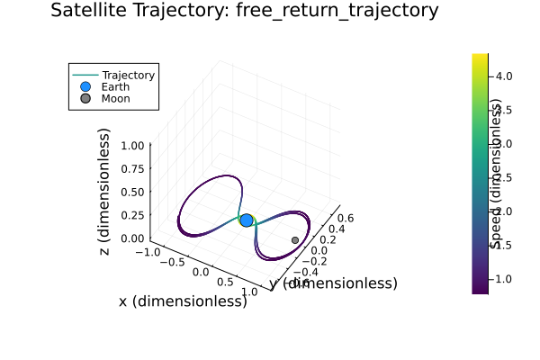

# Dokumentacija za Domačo Nalogo 3

## Funkcionalnosti paketa

```@docs
rk4_step
calculate_distances
three_body_eom
simulate_trajectory_earth_moon_system
plot_trajectory
run_and_plot_simulation
```

---

## 1   Razvoj matematičnega modela

### 1.1   Fizikalne konstante

Za modeliranje sistema Zemlja-Luna-satelit sem uporabil najnovejše vrednosti fizikalnih konstant, pridobljene iz uradnih virov:

- **Gravitacijska konstanta** $G = 6.67430 \times 10^{-11}$ m³ kg⁻¹ s⁻² - [Wikipedia](https://en.wikipedia.org/wiki/Gravitational_constant)
- **Masa Zemlje** $M_{Earth} = 5.9722 \times 10^{24}$ kg - [NASA Earth Fact Sheet](https://nssdc.gsfc.nasa.gov/planetary/factsheet/earthfact.html)
- **Masa Lune** $M_{Moon} = 7.346 \times 10^{22}$ kg - [NASA Moon Fact Sheet](https://nssdc.gsfc.nasa.gov/planetary/factsheet/moonfact.html)
- **Povprečna razdalja Zemlja-Luna** $D_{EM} = 3.844 \times 10^8$ m - [Wikipedia](https://en.wikipedia.org/wiki/Lunar_distance)

### 1.2   Brezdimenzijski parametri

Za poenostavitev problema sem uvedel brezdimenzijske količine, kjer je $M$ masa Zemlje in $m$ masa Lune:

$$\mu = \frac{m}{M + m} \approx 0.01215$$

$$\bar{\mu} = 1 - \mu = \frac{M}{M + m} \approx 0.98785$$

### 1.3   Enačbe gibanja

Enačbe gibanja za krožni omejeni problem treh teles sem pridobil iz skripte domačih nalog. V vrtečem se koordinatnem sistemu so enačbe gibanja za satelit:

Najprej definiramo razdalje do Zemlje in Lune, kjer so $(x, y, z)$ koordinate satelita:

$$R = R(x, y, z) = \sqrt{(x + \mu)^2 + y^2 + z^2},$$
$$r = r(x, y, z) = \sqrt{(x - \bar{\mu})^2 + y^2 + z^2}.$$

Enačbe gibanja v vrtečem se koordinatnem sistemu so:

$$\begin{align}
\ddot{x} &= x + 2\dot{y} - \frac{\bar{\mu}}{R^3}(x + \mu) - \frac{\mu}{r^3}(x - \bar{\mu}) \\
\ddot{y} &= y - 2\dot{x} - \frac{\bar{\mu}}{R^3}y - \frac{\mu}{r^3}y \\
\ddot{z} &= -\frac{\bar{\mu}}{R^3}z - \frac{\mu}{r^3}z
\end{align}$$

kjer so:
- **Hitrosti satelita**: $\dot{x}, \dot{y}, \dot{z}$
- **Pospeški satelita**: $\ddot{x}, \ddot{y}, \ddot{z}$
- **Razdalja do Zemlje**: $R$
- **Razdalja do Lune**: $r$

---

## 2   Numerična metoda

### 2.1   Runge-Kutta metoda 4. reda

Za numerično reševanje sistema običajnih diferencialnih enačb sem uporabil klasiko Runge-Kutta metodo 4. reda (RK4). Formulo za RK4 metodo sem pridobil iz skripte za numerično matematiko pri predmetu.

Za sistem $\frac{du}{dt} = f(u)$ je en korak RK4 metode:

$$\begin{align}
k_1 &= h \cdot f(u_n) \\
k_2 &= h \cdot f(u_n + \frac{1}{2}k_1) \\
k_3 &= h \cdot f(u_n + \frac{1}{2}k_2) \\
k_4 &= h \cdot f(u_n + k_3) \\
u_{n+1} &= u_n + \frac{1}{6}(k_1 + 2k_2 + 2k_3 + k_4)
\end{align}$$

kjer je:
- **Korak integracije**: $h$
- **Stanje sistema v času $t_n$**: $u_n$
- **Stanje sistema v času $t_{n+1} = t_n + h$**: $u_{n+1}$
- **Funkcija, ki opisuje odvode (enačbe gibanja)**: $f(u)$

### 2.2   Implementacija simulacije

Sistem simulira trajektorijo satelita v sistemu Zemlja-Luna z naslednjimi koraki:

1. **Inicializacija** - Nastavitev začetnih pogojev (pozicija in hitrost satelita)
2. **Iterativna integracija** - Uporaba RK4 metode za reševanje enačb gibanja
3. **Shranjevanje rezultatov** - Zapisovanje pozicij in hitrosti v vsakem časovnem koraku
4. **Vizualizacija** - Ustvarjanje 3D grafa trajektorije z barvno kodiranjem hitrosti

---

## 3   Simulacija trajektorij

### 3.1   Razvoj od enostavne orbite do free return trajectory

Za nalogo smo imeli simulirati **free return trajectory**. Da bi bolje razumeli kompleksnost tega problema, smo najprej simulirali preprosto orbitiranje satelita okoli Zemlje.

#### 3.1.1   Enostavna orbita

Najprej smo simulirali satelit v stabilni orbiti okoli Zemlje z začetnimi pogoji:
- Pozicija: $(0.2, 0.0, 0.0)$
- Hitrost: $(0.0, 1.938, 0.0)$ - hitrost v y-smeri za krožno orbito
- Časovni interval: $[0, 1]$ brezdimenzijskih enot
- Korak integracije: $h = 0.005$


Ta simulacija prikazuje satelit v relativno stabilni krožni orbiti okoli Zemlje. Hitrost je bila izbrana tako, da satelit ostane v Zemljinem gravitacijskem polju in ne zapusti sistema. Barva črte prikazuje hitrost satelita - vidimo, da se hitrost spreminja zaradi gravitacijskih vplivov, vendar ostaja satelit v okolici Zemlje.

#### 3.1.2   Prehod na free return trajectory

Nato smo satelitu spremenili hitrost v isti poziciji $(0.2, 0.0, 0.0)$ in dobili **free return trajectory**:
- Pozicija: $(0.2, 0.0, 0.0)$ - enaka kot pri enostavni orbiti
- Hitrost: $(1.954, 1.78, 0.0)$ - dodana hitrost v x-smeri
- Časovni interval: $[0, 10]$ brezdimenzijskih enot
- Korak integracije: $h = 0.005$



Dodajanje hitrosti v x-smeri $(1.954, 0, 0)$ je ključno za dosego free return trajectory. Ta dodatna hitrost omogoča satelitu, da:
1. **Zapusti Zemljino gravitacijsko polje** - satelit dobi dovolj energije za ubežanje
2. **Vstopi v lunarno gravitacijsko polje** - Luna privlači satelit
3. **Brez dodatnega goriva se vrne na Zemljo** - lunina gravitacija spremeni smer gibanja

### 3.2   Interaktivna simulacija

Za boljše razumevanje dinamike sistema je na voljo tudi [interaktivna spletna simulacija](assets/simulator.html), ki omogoča eksperimentiranje z različnimi začetnimi pogoji in opazovanje, kako majhne spremembe hitrosti vplivajo na trajektorijo satelita.

### 3.3   Analiza rezultatov

Primerjava obeh simulacij razkriva ključne razlike:

**Enostavna orbita:**
- Satelit ostane v Zemljinem gravitacijskem polju
- Trajektorija je relativno stabilna in predvidljiva
- Hitrost se spreminja zaradi gravitacijskih vplivov, vendar ostaja v okolici Zemlje

**Free return trajectory:**
- Satelit zapusti Zemljino gravitacijsko polje
- Trajektorija je kompleksna in vključuje interakcijo z Luno
- Hitrost se dramatično spreminja med različnimi fazami poti
- Satelit se brez dodatnega goriva vrne na Zemljo

Ta primerjava demonstrira, kako majhne spremembe začetnih pogojev lahko vodijo do popolnoma različnih orbitalnih dinamik v sistemu treh teles.

## 5   Zaključek

Implementacija krožnega omejenega problema treh teles uspešno simulira free return trajectory v sistemu Zemlja-Luna. Uporaba RK4 metode zagotavlja natančne rezultate, medtem ko brezdimenzijski pristop omogoča splošno uporabnost modela. Rezultati kažejo kompleksno dinamiko orbitalnega gibanja in demonstrirajo praktično uporabnost za načrtovanje vesoljskih misij. 
